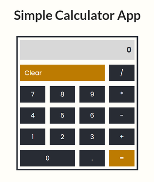

# Calculator-React-App

A simple calculator created with React. 

* It can do addition, subtraction, multiplication and division. 
* It has a clear button which deletes everything that is currently inputed in calculator.
* You are able to insert an expression and it will calculate only when you press = (equal) button.
* If some impossible input is written the error message ("Incorrect input, press Clear") will appear.
* Multiplication and division operations have priority so they will be done first, but if there are multiple priority operations in a row they will be done from left to right in order.

